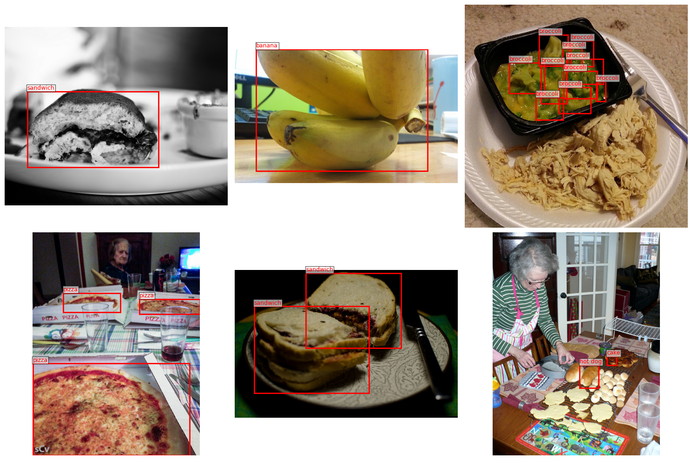
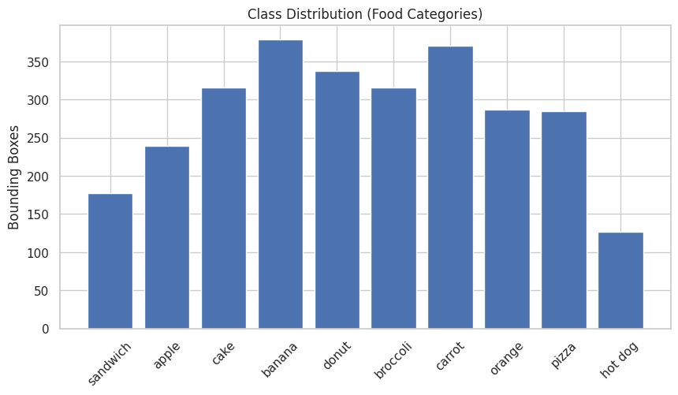
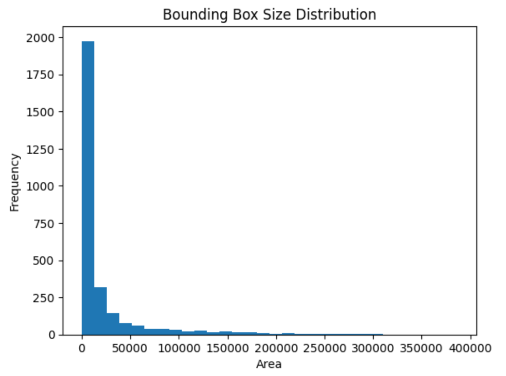
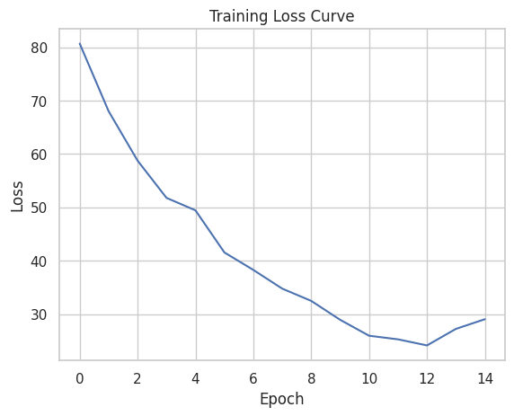

# Food Object Detection in Images 

## 1. Problem and Motivation

With the rapid development of artificial intelligence, modern diet tracking applications are becoming increasingly intelligent and automated. These systems leverage computer vision and deep learning techniques to analyze food images, enabling automatic food recognition, calorie estimation, and personalized nutrition management.

Instead of manually logging meals, users can simply take a photo of their food. The system then identifies the food items, estimates portion sizes, and provides nutritional information. This significantly improves usability and encourages healthier lifestyle choices.

This project is motivated by real-world applications such as diet tracking, calorie estimation, and food recognition apps, which rely heavily on robust and accurate food detection systems.

The goal of this project is to explore the process of training a detection model to recognize food objects in images and evaluate its performance in real-world scenarios.

## 2. Method

### 2.1 Data source

We use the **COCO dataset**.

Source: https://cocodataset.org/

Annotation type:

- Bounding boxes
- Object category labels

The full COCO dataset contains **80 object categories**, including several food-related classes.

### 2.2 Selected Dataset Description

This project focuses on the following food classes:

| Category | COCO ID |
|--------|--------|
| banana | 47 |
| apple | 48 |
| sandwich | 49 |
| orange | 50 |
| broccoli | 51 |
| carrot | 52 |
| hot dog | 53 |
| pizza | 54 |
| donut | 55 |
| cake | 56 |

Example images with annotations after filtering are shown below.

After filtering the dataset to only include images containing these food categories:

- Images: ~708
- Classes: 10
- Multiple bounding boxes per image

The number of bounding boxes per class ranges from 120 to 370.

| Class      | Image Count | Bounding Box Count |
|------------|------------|--------------------|
| sandwich   | 98         | 177                |
| apple      | 76         | 239                |
| cake       | 124        | 316                |
| banana     | 103        | 379                |
| donut      | 62         | 338                |
| broccoli   | 71         | 316                |
| carrot     | 81         | 371                |
| orange     | 85         | 287                |
| pizza      | 153        | 285                |
| hot dog    | 51         | 127                |

The distribution of bounding box areas is highly right-skewed, with most instances concentrated below approximately 20,000, while a small number extend beyond 100,000, reaching up to around 300,000.

### 2.3 Data Splitting 

The dataset is divided into training and validation subsets using an 80/20 split. 

Specifically, 566 images are used for training, while 142 images are reserved for validation.

### 2.4 Model Overview 

This project compares two models for food object recognition in images: a classical machine learning baseline and a deep learning-based object detection model. The goal is to evaluate their performance differences under the same task setting.

1. **Classical Baseline: HOG + Linear SVM**

The classical model follows a feature-based classification pipeline.

Pipeline：

Image
→ Preprocessing (resize, grayscale conversion)
→ HOG feature extraction
→ Feature vector representation
→ Linear SVM classifier
→ Class prediction

Components：

HOG feature extractor: Converts images into gradient-based feature representations by computing histograms of oriented gradients.

Linear SVM: Performs classification on extracted feature vectors using a linear decision boundary.

Limitation：

This model does not perform object localization and relies entirely on handcrafted feature representations, which limits its ability to capture complex visual variations.

2. **Detection Model: Fine-tuned Faster R-CNN**

The second model is a deep learning-based object detection framework, fine-tuned on the target dataset.

Pipeline：

Image
→ Backbone CNN feature extraction
→ Region Proposal Network (RPN)
→ Region proposals
→ ROI Align
→ Classification head + bounding box regression
→ Final predictions (class + location)

Components：

Backbone CNN: Extracts hierarchical feature maps from input images.

RPN (Region Proposal Network): Generates candidate object regions.

ROI Align: Extracts fixed-size feature representations for each proposal.

Detection head: Performs classification and bounding box regression.

Limitation：

The model requires more computation and is sensitive to training data distribution and imbalance.

### 2.5 Evaluation Metrics

1. **Unified Evaluation Metrics**

To ensure a fair comparison, we adopt the same true positive (TP) definition for both the classical model and the detection model.

A prediction is considered a true positive (TP) if:

the predicted class label is correct, and
the IoU between predicted and ground-truth bounding boxes is greater than 0.5.

Based on this definition, we compute the following standard classification metrics:

**Precision**

**Recall**

**F1-score**

These metrics are used to evaluate overall classification performance across models.

2. **Detection-specific Metrics (Faster R-CNN)**

In addition to the unified metrics above, we also evaluate detection performance using bounding-box-level metrics for the Faster R-CNN model.

**Class Accuracy：**

Measures whether the predicted class label matches the ground truth for each detected object.

**Box Accuracy (IoU-based)：**

Measures the quality of localization by evaluating whether predicted bounding boxes sufficiently overlap with ground truth annotations using IoU thresholds.

## 3. Results and Comparison

**Training Details (Fine-tuning)**

Optimizer: Adam

Learning rate: 1e-4

Batch size: 4

Epochs: 12

### 3.1 Faster R-CNN Result

| Class (Name) | GT Samples | Class Acc | Box Acc | Joint Acc |
|--------------|-----------|----------|--------|-----------|
| 1 (apple)    | 61        | 0.0820   | 0.0820 | 0.0820    |
| 2 (sandwich) | 29        | 0.3793   | 0.5172 | 0.3793    |
| 3 (orange)   | 51        | 0.2549   | 0.2745 | 0.2549    |
| 4 (broccoli) | 55        | 0.3455   | 0.3455 | 0.3455    |
| 5 (carrot)   | 57        | 0.2105   | 0.2281 | 0.2105    |
| 6 (hot dog)  | 13        | 0.2308   | 0.4615 | 0.2308    |
| 7 (pizza)    | 71        | 0.4789   | 0.5493 | 0.4789    |
| 8 (donut)    | 81        | 0.4198   | 0.4568 | 0.4198    |
| 9 (cake)     | 51        | 0.3137   | 0.3529 | 0.3137    |

#### 3.11 Overall Performance
Overall, the model shows moderate performance across all food categories, with noticeable variation between classes. Performance is generally higher for categories with larger sample sizes (e.g., pizza, donut), while lower results are observed in underrepresented or visually complex categories (e.g., apple, hot dog).

The gap between Class Accuracy and Box Accuracy is generally small, indicating that localization quality is relatively consistent with classification performance.

#### 3.12 Per-Class Performance

Performance varies significantly across different food categories:

1. High-performing classes:

pizza (Class Acc: 0.4789)

donut (0.4198)

sandwich (0.3793)

These categories tend to have more distinctive shapes and stronger visual patterns, making them easier to detect.

2. Medium-performing classes:

broccoli, cake, orange

These classes show moderate accuracy but are affected by visual variability.

3. Low-performing classes:

apple (0.0820)
hot dog (0.2308)

These classes are more difficult due to small object size, shape variability, or similarity to other categories.

#### 3.13 Key Insights

Detection performance is strongly influenced by class imbalance and visual complexity

The model performs better on distinct, large, and well-represented categories

Localization (Box Acc) is generally more stable than classification in ambiguous cases

### 3.2 Model Comparison

Faster R-CNN Result:

| Class | Precision | Recall | F1-score |
| ---------- | --------- | ------ | -------- | 
| apple      | 0.1316    | 0.0820 | 0.1010   | 
| sandwich   | 0.3243    | 0.4138 | 0.3636   |
| orange     | 0.2600    | 0.2549 | 0.2574   |
| broccoli   | 0.4318    | 0.3455 | 0.3838   | 
| carrot     | 0.3243    | 0.2105 | 0.2553   | 
| hot dog    | 0.7500    | 0.2308 | 0.3529   | 
| pizza      | 0.6364    | 0.4930 | 0.5556   | 
| donut      | 0.6415    | 0.4198 | 0.5075   | 
| cake       | 0.8000    | 0.3137 | 0.4507   |

HOG + Linear SVM Result

| Class    | Precision | Recall | F1-score | 
| -------- | --------- | ------ | -------- | 
| apple    | 0.19      | 0.19   | 0.19     | 
| sandwich | 0.12      | 0.11   | 0.12     | 
| orange   | 0.29      | 0.26   | 0.28     |
| broccoli | 0.29      | 0.32   | 0.30     | 
| carrot   | 0.25      | 0.22   | 0.23     |      
| hot dog  | 0.00      | 0.00   | 0.00     |      
| pizza    | 0.31      | 0.32   | 0.31     |      
| donut    | 0.26      | 0.28   | 0.27     |      
| cake     | 0.21      | 0.24   | 0.22     |      

Overall, the Faster R-CNN model significantly outperforms the classical HOG + Linear SVM baseline across most categories. In general, the deep learning-based approach achieves higher precision, recall, and F1-score, especially for visually distinctive categories such as pizza, donut, and cake. In contrast, the classical model shows relatively limited performance and fails completely on some categories (e.g., hot dog).

From a per-class perspective, Faster R-CNN demonstrates clear advantages in most categories. For example, pizza achieves an F1-score of 0.5556 compared to 0.31 in the classical model, while donut improves from 0.27 to 0.5075. Similar improvements can also be observed in sandwich, broccoli, and cake. These results indicate that the deep learning model is better at capturing complex visual patterns and object variations.

However, the performance gain is not uniform across all categories. For some classes such as apple and orange, the improvement is relatively limited or even marginal. This suggests that both models are still affected by intrinsic challenges such as small object size, intra-class variation, and visual similarity between categories.

The classical HOG + SVM model shows consistently lower performance across most categories, with particularly poor results in hot dog, where all metrics are zero. This reflects the limitation of handcrafted feature representations, which are not robust enough to handle complex visual diversity in food images.

In contrast, Faster R-CNN benefits from end-to-end feature learning and region-based detection, which allows it to better localize and classify objects. The model shows especially strong improvements in categories with distinctive shapes and textures, demonstrating the advantage of deep feature representations over traditional feature engineering.

Overall, the comparison highlights a clear performance gap between the two approaches. While HOG + SVM provides a simple baseline, Faster R-CNN achieves significantly better detection performance, confirming the effectiveness of deep learning-based object detection methods for this task.

## 4. Failure Cases 

Common Failure Cases:

1. Small / Low-Resolution Objects
- Limited pixel information
- Weak feature representation

2. Appearance Variation after Processing
- Food changes after cooking / cutting
- Shape deformation (e.g., sliced, mixed forms)
- Color variation due to sauces or seasoning
- Hard to match original category appearance

3. Occlusion in Real Scenes
- Partial visibility of objects
- Overlapping items in cluttered environments
- Missing key visual cues

## 5. Limitations and Takeaways 

### 4.1 Limitations

One major limitation of this study is the limited dataset scale. Only a subset of the COCO dataset (708 images) is used for training and evaluation. This relatively small dataset may not fully capture the diversity and complexity of real-world food distributions, which can affect model generalization.

Another limitation is the simplified evaluation setting. The evaluation relies on a fixed IoU threshold of 0.5, which may not fully reflect detection quality under more rigorous standards. In addition, further in-depth error analysis beyond quantitative metrics was not extensively conducted, limiting deeper understanding of model failure cases.

From a methodological perspective, the classical model (HOG + SVM) relies on hand-crafted features, which inherently limits its representational capacity. In contrast, while the Faster R-CNN model improves performance significantly, it still requires more extensive training data and computational resources, which were constrained in this project setting.

### 4.2 Takeaways

This project demonstrates a clear performance gap between classical and deep learning approaches. Classical methods (HOG + SVM) rely on hand-crafted features, resulting in limited representational power and weaker performance on complex visual tasks.

In contrast, deep learning models (Faster R-CNN) significantly improve feature learning capability and detection performance by learning hierarchical visual representations in an end-to-end manner.

Overall, the results highlight the importance of learned feature representations in modern computer vision tasks, especially for object detection problems involving complex and diverse visual patterns.

### 4.3 Future Work

Future work can focus on several directions. First, expanding the dataset to include more images and more diverse food categories would improve model robustness and generalization ability. Second, adopting more comprehensive evaluation metrics would provide a more detailed assessment of detection performance.

In addition, more detailed error analysis could be conducted to better understand failure cases, such as confusion between visually similar categories or performance degradation on small objects. Finally, exploring more advanced detection architectures or lightweight models could further improve both accuracy and efficiency for real-world deployment scenarios.